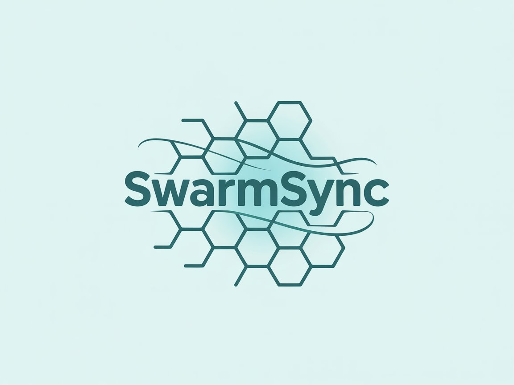

# SwarmSync

SwarmSync: Your AI dream team for autonomous, human-like task synchronization. Build smarter, faster, and together.



SwarmSync is a cutting-edge platform for building **AI-powered agent swarms** that collaborate like elite human teams to autonomously handle complex tasks, such as software development, market research, and operational workflows, 10x faster and at a fraction of the cost.

🌟 **Why SwarmSync?** Unlike single-agent AI or rigid automation tools, SwarmSync's vertical multi-agent swarms mimic human teamwork, dynamically allocating tasks, making decisions, and integrating with tools like Search Engine, Web Browsers, GitHub, Linear, etc. To add more modalities, we are currently working on the MCP setup as well to provide smoother agentic capabilities with tools.

## Features

- **Human-Like Collaboration**: Role-based AI agents (e.g., PM, Developer, Researcher) work together autonomously, with dynamic task allocation and multi-turn decision-making.
- **Vertical AI Swarms**: Specialized swarms tailored for domains like software development, research, or operations, syncing tasks with human-like precision.

## SDK

Build custom swarms programmatically with the SwarmSync SDK.

Install the SDK:

```bash
pip install swarmsync-sdk # Releasing soon! Stay tuned for our SDK documentation and examples.
```

Example usage:
```python
# Coming soon! Stay tuned for our SDK documentation and examples.
```

## License

SwarmSync is licensed under the Apache-2.0 License (LICENSE). Feel free to use, modify, and distribute it as per the license terms.

## Contact

- GitHub: [TheBinder-AI/SwarmSync-SDK](https://github.com/TheBinder-AI/SwarmSync-SDK)
- X (Twitter): [@TheBinderAI](https://x.com/TheBinderAI)


## Acknowledgements
We'd like to acknowledge the excellent work of the open-source community, especially:

-   [Pydantic](https://docs.pydantic.dev/latest/) (data validation) and [PydanticAI](https://ai.pydantic.dev/) (advanced agent framework)

We're committed to continuing to build the SwarmSync Agents SDK as an open-source framework so others in the community can expand on our approach.
