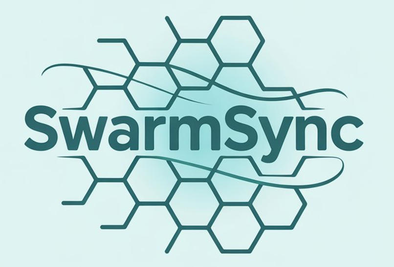
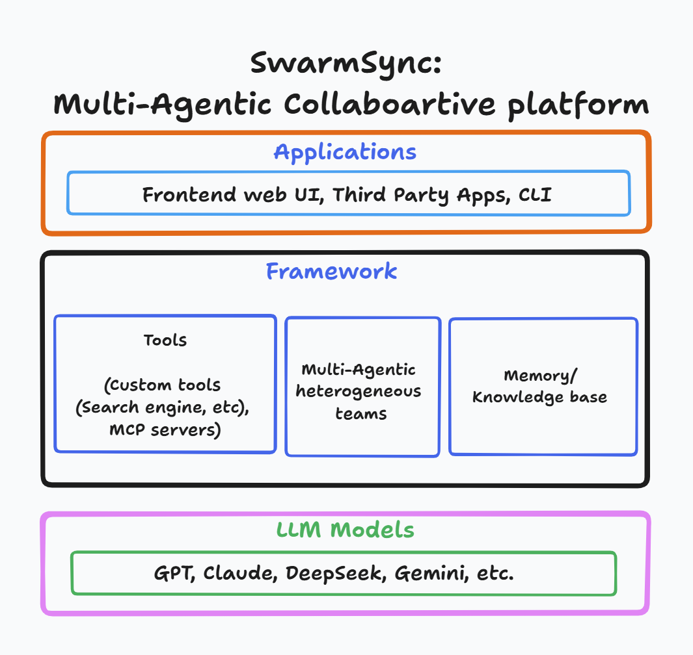

<h1 align="center">SwarmSync SDK</h1>
<p align="center">Collaborative AI Agent Swarms for Autonomous Task Synchronization</p>

<p align="center">
  
</p>

Welcome to **SwarmSync SDK**, a cutting-edge platform for building **AI-powered agent swarms** that collaborate like elite human teams. Our vertical multi-agent swarms autonomously handle complex tasks—software development, market research, operational workflows—**10x faster** and at a fraction of the cost.

> **Note**: SwarmSync SDK is currently in alpha development. While we're excited to share our progress, please be aware that:
> - The API and features are subject to change
> - We're actively gathering feedback and improving the framework
> - Production use is not recommended at this stage
> - We welcome contributions and feedback from the community

🌟 **Why SwarmSync?**  
Unlike single-agent AI or rigid automation tools, SwarmSync's swarms mimic human teamwork with **dynamic task allocation**, **multi-turn decision-making**, and seamless integration with tools like Search Engines, Web Browsers, GitHub, and Linear. We're also working on **MCP setup** to enhance agentic capabilities, bringing even smoother collaboration.

## Overview

SwarmSync framework design diagram:

<p align="center">
  
</p>

## Key Features

- **Human-Like Collaboration**: Role-based AI agents (e.g., PM, Developer, Researcher) work together autonomously, with dynamic task allocation and multi-turn decision-making.
- **Vertical AI Swarms**: Specialized swarms tailored for domains like software development, research, or operations, syncing tasks with human-like precision.
- **Extensible Tools**: Seamless integration with tools like Search Engine, Web Browsers, GitHub, Linear, and more.
- **MCP Integration**: Model Context Protocol setup for enhanced agentic capabilities.

## Quick Start

### Installation

```bash
# Install the SDK
pip install swarmsync-sdk

# For full installation with browser tools
pip install swarmsync-sdk[full]
```

### Basic Usage

```python
from swarmsync import AgentTeam, Agent, Task
from swarmsync.common import ModelFactory

# Initialize the model factory
model_factory = ModelFactory()

# Create a team
team = AgentTeam(
    name="example_team",
    description="A simple example team",
    model=model_factory.get_model("gpt-4")
)

# Create and add agents
researcher = Agent(
    name="researcher",
    system_prompt="You are a research specialist",
    model=model_factory.get_model("gpt-4")
)

team.add(researcher)

# Run a task
task = Task(content="Research the latest trends in AI")
result = team.run(task)
```

## SDK Test Environment

This directory contains test and example code for the SwarmSync SDK.

### Structure

```
sdk_test/
├── examples/
│   └── basic_usage.py    # Basic SDK usage example
├── tests/
│   └── test_basic_usage.py  # Unit tests for basic functionality
└── pyproject.toml        # Project configuration and dependencies
```

### Development Setup

1. Create a virtual environment:
```bash
python -m venv venv
source venv/bin/activate  # On Windows: .\venv\Scripts\activate
```

2. Install development dependencies:
```bash
# Install the SDK in development mode
pip install -e ".[full]"

# Install testing dependencies
pip install pytest pytest-cov
```

### Running Examples

To run the basic usage example:
```bash
python examples/basic_usage.py
```

### Running Tests

To run the test suite:
```bash
pytest
```

For test coverage report:
```bash
pytest --cov=swarmsync
```

## Development

The SDK test environment is set up to help you:
- Test new features
- Verify SDK functionality
- Create example code
- Run unit tests


## Use Cases/ Demos

#### Product Engineering Team Demo - 1
Showcasing a collaborative AI swarm that follows FAANG best practices and agile methodologies. The demo demonstrates how our AI agents work together to handle complex software development tasks with human-like precision.

<iframe width="100%" height="400" src="https://www.youtube.com/embed/ZdO7fQjTuk4" title="Product Engineering Team Demo" frameborder="0" allow="accelerometer; autoplay; clipboard-write; encrypted-media; gyroscope; picture-in-picture" allowfullscreen></iframe>

The team consists of:
- Product Manager
- Senior Developer
- QA Lead


## Contributing

1. Write tests for new features
2. Add examples for new functionality
3. Update documentation as needed
4. Run tests before submitting changes

## Acknowledgements

We'd like to acknowledge the excellent work of the open-source community, especially:

- [Pydantic](https://docs.pydantic.dev/latest/) (data validation) and [PydanticAI](https://ai.pydantic.dev/) (advanced agent framework)

We're committed to continuing to build the SwarmSync Agents SDK as an open-source framework so others in the community can expand on our approach.

## License

SwarmSync is licensed under the [Apache-2.0 License](LICENSE). Feel free to use, modify, and distribute it as per the license terms.

## Contact

- GitHub: [TheBinder-AI/SwarmSync-SDK](https://github.com/TheBinder-AI/SwarmSync-SDK)
- X (Twitter): [@TheBinderAI](https://x.com/TheBinderAI)
